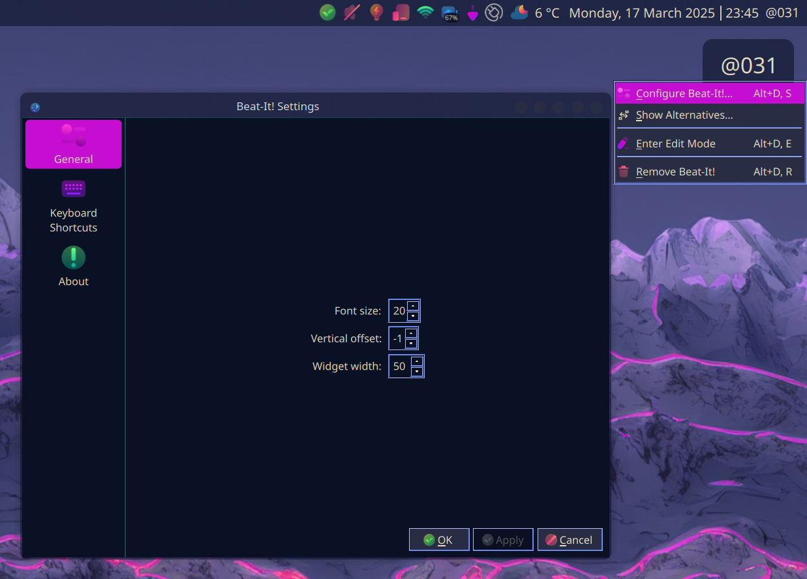

# Beat-It!
A KDE Plasma 6 Plasmoid displaying the current time in [Swatch Internet Time](https://en.wikipedia.org/wiki/Swatch_Internet_Time) "beats" *(only 90s kids will remember)*
-----
Do you remember Swatch Internet Time from back in the days of breathless optimism about the Internet? Does "beats" ring a bell with you? Do you always crack a beer at @666? Are you experiencing renal failure?  

If you answered "yes" to one or more of these questions, ask your doctor if "Beat-It!" is right for you.  

"Beat-It!" is an implementation of Swatch Internet Time which displays the current time in "beats" as a Plasma 6 Plasmoid. In your menubar, on your desktop, on some third thing not yet conceived-- these three numbers preceded by a glyph can be your constant companion as you beat your way through the day, never sleeping, always beating, and occasionally cracking a new beer.  

------
### Overview
The plasmoid in both menubar and desktop guises:  
  

Its config panel:  

## NOTA BENE  
**I DID NOT WRITE THIS!**  
Not exactly, anyway. This was created as an experiment in 'vibe coding' which I decided to undertake after reading about it on Twitter.

Rather than learning anything about how to write a Plasma 6 Plasmoid, I just argued with Cursor until it went completely off the rails, then had ChatGPT fix it, then gave the code back to Cursor to polish until I was happy with it.

All in all, it probably would have been faster to read [@dhruv8sh's excellent article here](https://medium.com/@dhruv8sh_34505/write-an-applet-for-plasma-6-0b8fd3a0334f) myself, but that was not the point of the exercise! In the end, I had to paste the contents of that article into Cursor to get it to stop hallucinating and generate a valid file structure and working configuration pane.

Please enjoy our first and (comparatively speaking) most adequate release.
